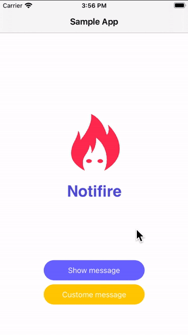

# Notifire

# Description
Notifire is a message view library for iOS. It's very flexible. And written in Swift.

Message views can be displayed at the top of the screen, over or under the status bar, and infront of the navigation bars. There's an interactive dismiss gesture. You can dim the background if you like. And a lot more!

This library provides an easy to use class to show notification views.
there are three types (intro, error, warning).

# New Feature
you can handle a closure when the notifire is finished

finally insert this code for show notification message:

        Notifire.shared.show(type: .error, message: "this is a test") {
            // you can insert your task 
            print("finish")
        }
        
# Demo

  

# Install
Notifire is available on Cocoapods

    pod "Notifire"
    
# How to use
you must first import Notifire.

     import Notifire
     
if you want to change font it's better that you set it in the appDelegate:

     Notifire.shared.title.font = UIFont(name: "tahoma", size: 12)!
     Notifire.shared.title.textAlignment = .center
     
     // for change text color
     Notifire.shared.color = .white

finally insert this code for show notification message:

     Notifire.shared.show(type: .error, message: "this is a message")

# LICENSE
Notifire is available under the MIT license. See the LICENSE file for more information.
